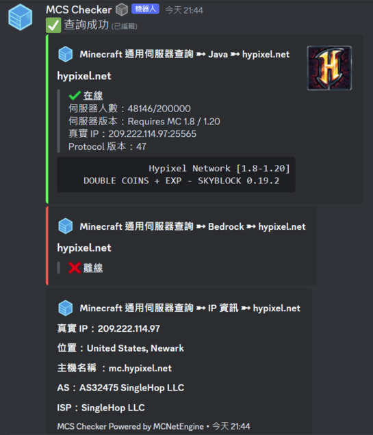

# DiscordBot MCNetEngine
一個可藉由 Discord Bot 查詢 Minecraft 伺服器與 IP 資訊的機器人。

並且僅需一個指令即可同時查詢 Java & Bedrock 伺服器相關資訊。

**__邀請機器人__**：[點我邀請](https://discord.com/api/oauth2/authorize?client_id=1137263687804129290&permissions=274878171136&scope=bot)

## 功能
* /mcs \<IP>  - 查詢 Minecraft 伺服器資訊（Java & Bedrock）
* /debug - 機器人資訊

### 功能展示

## 必需函式庫
僅代表開發時使用版本，不代表其他版本無法部署。

|函式庫名稱 |版本|
|-----|--------|
|py-cord|2.3.1|
|requests|2.28.1|

## 設定
[MCNetEngine/main.py](https://github.com/FanYueee/MCNetEngine/blob/main/main.py)

僅需設定機器人的 Token 即可。

## 使用的 API
查詢 Minecraft 伺服器相關資訊－https://api.mcsrvstat.us/

查詢 IP 相關資訊－http://ip-api.com/

